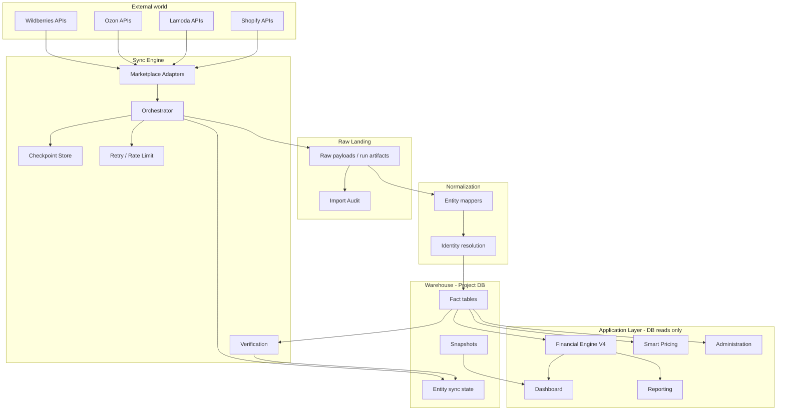
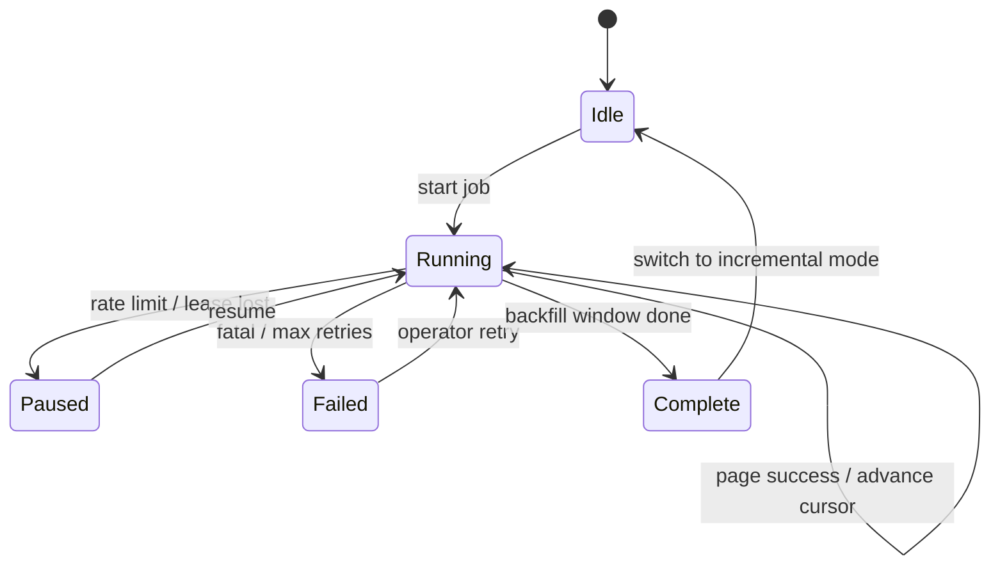

# Historical Data Warehouse Platform — Sprint 10.0 Architecture Specification

---

Status

Draft (Blueprint)

---

Owner

Product Owner

---

Audience

- Developers
- AI Assistants
- Product Owner
- Architects

---

Module

—

---

Category

Architecture

---

Dependencies

- [Project DNA](../00-project/PROJECT_DNA.md)
- [Historical Data Warehouse](./HISTORICAL_DATA_WAREHOUSE.md) (philosophy)
- [Sync Engine](./SYNC_ENGINE.md) (intake philosophy)
- [System Architecture](./SYSTEM_ARCHITECTURE.md)
- [Database](./DATABASE.md)
- [Integration Architecture](./INTEGRATION_ARCHITECTURE.md)
- [Reporting Architecture](./REPORTING_ARCHITECTURE.md)
- [Accounting Rules](../01-business/ACCOUNTING_RULES.md)
- [Glossary](../01-business/GLOSSARY.md)

---

Related Documents

- [Historical Data Warehouse](./HISTORICAL_DATA_WAREHOUSE.md)
- [Sync Engine](./SYNC_ENGINE.md)
- [Operational Architecture](./OPERATIONAL_ARCHITECTURE.md)
- [Decisions Index](../06-decisions/INDEX.md)

---

Related ADRs

—

---

Version

10.0.0

---

Last Updated

2026-07-31

---

Review Frequency

Before each Sprint 10.x implementation slice

---

Source of Truth

This file (operational platform blueprint).  
[Historical Data Warehouse](./HISTORICAL_DATA_WAREHOUSE.md) remains the **philosophical** authority.  
This document specifies **how** the platform is structured for implementation sprints.

---

Purpose

Define the complete Historical Data Warehouse architecture that powers Dashboard, Reporting, and Smart Pricing. Marketplace APIs are synchronization sources only. The project database is the application’s single source of truth for reads.

---

Scope

Architecture specification only.

**In scope:** layers, sync pipeline, checkpoints, idempotency, freshness, multi-marketplace isolation, failure recovery, read models, roadmap.

**Out of scope:** migrations, workers, queues, cron, UI, API implementation, Financial Engine formula changes.

---

## 0. Vision & Non-Negotiables

```text
Marketplace APIs  ≠  Application data source
Project database  =  Application single source of truth
Marketplace APIs  =  Synchronization sources only
```

| Rule | Meaning |
|------|---------|
| Historical first | Prefer durable warehouse facts over live API reconstruction |
| Incremental forever | After backfill, advance continuously — do not re-download all history by default |
| Idempotent synchronization | Re-running sync must not duplicate business truth |
| Replayable imports | Any historical import can be re-executed safely with audit |
| Multi-marketplace ready | WB / Ozon / Lamoda / Shopify share contracts; adapters stay isolated |
| Database-first reporting | Dashboard, Reporting, Smart Pricing read DB only |
| Financial Engine unchanged | Warehouse feeds inputs; Model B / V4 formulas are not redesigned here |

**Explicit prohibition:** Application modules must never call Wildberries (or other marketplace) APIs at read time for KPIs, reports, or pricing recommendations.

---

## 1. High-Level Architecture

### 1.1 End-to-end flow

```text
┌─────────────────────────────────────────────────────────────────┐
│                     MARKETPLACE APIs                            │
│         (WB · Ozon · Lamoda · Shopify — sync sources only)      │
└────────────────────────────┬────────────────────────────────────┘
                             │  authenticated, rate-limited fetch
                             ▼
┌─────────────────────────────────────────────────────────────────┐
│                       SYNC ENGINE                               │
│   Backfill · Incremental · Checkpoint · Retry · Verification    │
└────────────────────────────┬────────────────────────────────────┘
                             │
                             ▼
┌─────────────────────────────────────────────────────────────────┐
│                      RAW LANDING                                │
│     Immutable intake payloads + sync run metadata (audit)       │
└────────────────────────────┬────────────────────────────────────┘
                             │
                             ▼
┌─────────────────────────────────────────────────────────────────┐
│                     NORMALIZATION                               │
│   Tenant scope · Identity keys · Type coercion · Dedup keys     │
└────────────────────────────┬────────────────────────────────────┘
                             │
                             ▼
┌─────────────────────────────────────────────────────────────────┐
│                 HISTORICAL DATA WAREHOUSE                       │
│   Orders · Sales · Finance · Products · Stocks · Prices · …     │
│   Entity sync state · Import audit · Verification snapshots     │
└────────────────────────────┬────────────────────────────────────┘
                             │  database reads only
              ┌──────────────┼──────────────┬──────────────┐
              ▼              ▼              ▼              ▼
         Dashboard      Reporting     Smart Pricing   Administration
         Purchases      Cost Mgmt     Inventory*      Product Analytics
```

\* Inventory History already exemplifies warehouse-only reads (`historical_inventory_snapshots`).

### 1.2 Data flow diagram (logical)



### 1.3 Separation of concerns

| Component | Owns | Does not own |
|-----------|------|--------------|
| Marketplace APIs | Upstream trading reality | Seller reporting truth |
| Sync Engine | Intake, checkpoints, retries | Revenue / Net Profit meaning |
| Warehouse | Durable scoped facts | UI journeys |
| Financial Engine | Interpretation (Model B) | Sync scheduling |
| Application modules | Presentation & decisions | Direct marketplace reads |

---

## 2. Data Layers

### 2.1 Layer stack

```text
Application Layer     →  UI / reports / simulators (consume interpreted metrics)
Analytics Layer       →  Derived read models, rollups, optional marts (still DB)
Normalized Layer      →  Canonical entity tables (warehouse facts)
Raw Layer             →  Landing / audit of what was received
```

### 2.2 Raw Layer

**Purpose:** Preserve what the Sync Engine received so imports are replayable and debuggable.

**Belongs here:**

- Sync run identity (account, entity, mode: backfill | incremental, window)
- Request fingerprints (endpoint family, date window, cursor)
- Payload digests or stored raw batches (implementation choice in 10.x)
- Timing, HTTP status class, rate-limit signals
- Import audit rows (records read / upserted / skipped / errors)

**Does not belong here:**

- Business KPIs
- Financial Engine outputs
- UI state

**Rule:** Raw is append-oriented audit. Correcting business truth happens via re-normalization into the warehouse with a new audit row — not by silently rewriting Raw history.

### 2.3 Normalized Layer (Warehouse facts)

**Purpose:** Canonical, tenant-scoped business entities used by all modules.

**Belongs here:**

| Domain | Examples (WB today → generic tomorrow) |
|--------|------------------------------------------|
| Catalog | Products, brands, categories, mappings |
| Commerce | Orders, sales / purchases, cancellations |
| Settlement | Finance detail / report lines, payouts |
| Inventory | Stock points, historical inventory snapshots |
| Pricing | Marketplace prices / discounts (as recorded) |
| Ads | Advertising spend facts (when synced) |
| Seller inputs | Product cost history, purchases ledger |

**Does not belong here:**

- Marketplace adapter DTOs
- Session / auth cookies
- Ephemeral “live only” caches used as reporting sources

**Rule:** Every row is bound to `company_id` / `marketplace_account_id` (and marketplace type). No cross-tenant facts.

### 2.4 Analytics Layer

**Purpose:** Optional derived structures that speed Dashboard / Reporting without becoming a second source of truth.

**Belongs here:**

- Materialized period rollups (if introduced)
- Pre-aggregated category / brand contribution tables
- Verification / coverage summary views
- Export staging for management reports

**Rules:**

1. Analytics Layer is **rebuildable** from Normalized Layer.
2. Financial Engine may read Normalized directly or Analytics marts — never marketplace APIs.
3. If Analytics disagrees with Normalized + Engine, Normalized + Engine win.

### 2.5 Application Layer

**Purpose:** Product modules and journeys.

**Belongs here:**

- Dashboard Commercial Performance
- Reporting Module (P&L, Settlement, Product / Category / Brand Profit, exports)
- Smart Pricing / Profit Simulator
- Purchases & Cost Management (seller-maintained cost truth persisted into warehouse)
- Administration / Sync monitoring UI
- Product Analytics (operational + financial views over warehouse facts)

**Rules:**

1. Read path: Application → services → **project DB** (+ Financial Engine on warehouse inputs).
2. Write path for seller data (costs, purchases): Application → validated services → warehouse tables.
3. Sync triggers: Application may **request** Sync Engine work; it must not scrape APIs for page renders.

---

## 3. Historical Backfill

### 3.1 When it runs

Triggered when a Marketplace Account enters historical initialization (Account Lifecycle):

```text
NEW_ACCOUNT
  → HISTORICAL_BACKFILL_RUNNING
  → HISTORICAL_BACKFILL_VERIFYING
  → HISTORICAL_BACKFILL_COMPLETE
  → INCREMENTAL_SYNC_ACTIVE
  → HEALTHY   (only after verification)
```

Backfill establishes depth so reporting is not limited to “since we turned sync on.”

### 3.2 Entities & API families (Wildberries reference)

Order is dependency-aware: catalog before facts that reference SKUs; finance after sales windows where practical.

| Order | Entity | Sync source (WB) | Warehouse target (conceptual) | Notes |
|------:|--------|------------------|-------------------------------|-------|
| 1 | Products / content | Content API | Products + relations | Identity for all SKU joins |
| 2 | Prices | Prices / discounts APIs | Price facts | Optional early; needed for pricing modules |
| 3 | Orders | Statistics orders | Orders | Funnel & logistics matching |
| 4 | Sales | Statistics sales | Sales (+ revenue fields) | Customer payment / finishedPrice basis |
| 5 | Finance | Finance report detail | Finance lines | Settlement / seller payout inputs |
| 6 | Stocks (PIT) | Stocks API | Current stock cache + optional snapshot | Point-in-time; not a deep history by itself |
| 7 | Inventory history | Archive / snapshot pipeline | Historical inventory snapshots | Separate backfill where archives exist |
| 8 | Advertising | Ads API (when enabled) | Ads facts | May lag; non-blocking for HEALTHY if declared optional |

**Ozon / Lamoda / Shopify:** same entity order; different adapters and identity keys.

### 3.3 Progress tracking

Per account, per entity (see §5 Checkpoint Model):

| Field (conceptual) | Meaning |
|--------------------|---------|
| `stage` | pending → running → verifying → complete → failed |
| `window_from` / `window_to` | Historical range claimed |
| `cursor` / `checkpoint_token` | Resume position inside window |
| `rows_upserted` | Progress counter |
| `last_success_at` | Heartbeat |
| `last_error` | Visible failure |
| `verification_status` | Coverage judgment |

Account-level progress = rollup of required entities (finance + sales + orders + products as core).

### 3.4 Resume

1. Orchestrator loads entity checkpoint.
2. If `stage = running` and cursor present → continue from cursor (never restart whole history blindly).
3. If process died mid-window → resume same window; upserts remain idempotent (§6).
4. Completed entities are not re-backfilled unless operator requests **replay** (explicit).

### 3.5 Retries

| Failure class | Policy |
|---------------|--------|
| Transient HTTP 5xx / network | Exponential backoff, capped attempts, then pause entity |
| Rate limit (429) | Honor `Retry-After`; global per-account token bucket |
| Auth / credential | Fail entity; alert; do not burn retries |
| Validation / schema drift | Dead-letter payload + audit; skip row; continue batch when safe |
| Partial window success | Persist successful upserts; leave cursor at first incomplete page |

### 3.6 Partial failures

- **Never** mark account `HEALTHY` if a required entity is `failed` or unverified.
- Partial success is first-class: warehouse may contain a coherent prefix of history with Coverage gaps declared.
- Operator UI / Administration shows entity matrix (complete / gap / failed).
- Re-run is entity-scoped and replayable (new import audit row).

---

## 4. Incremental Sync

After backfill complete, continuous synchronization keeps the warehouse current.

### 4.1 Entity matrix

| Entity | Checkpoint basis | Typical cadence | Idempotency grain |
|--------|------------------|-----------------|-------------------|
| Orders | `dateFrom` cursor / last order timestamp | Frequent (e.g. 15–60 min) | Marketplace order id + account |
| Sales | `dateFrom` cursor / last sale timestamp | Frequent | Sale identity (e.g. srid / sale id) + account |
| Finance | Report / operation date watermark + report ids | Daily + gap recovery | Finance line natural key + account |
| Products | Full or delta catalog sync watermark | Daily / on-demand | nm_id / SKU + account |
| Stocks | Snapshot timestamp | Daily (or more) | product + warehouse + as_of |
| Prices | Sync watermark | Daily / on-demand | product + price type + as_of |

Cadences are **targets**, not SLAs carved in stone — freshness budgets are in §7.

### 4.2 Checkpoint strategy

For each `(marketplace, company, account, entity)`:

1. Store **high-water mark** that is safe to resume from (inclusive overlap of 1 step is allowed; upserts absorb duplicates).
2. Prefer **business time** watermarks (operation date, sale date) over wall-clock only.
3. Finance may use **report-centric** checkpoints (report id list + gap detector) in addition to dates.
4. Overlap window (e.g. re-fetch last N hours) is encouraged for late-arriving marketplace rows.

### 4.3 Scheduling

Conceptual scheduler (implementation deferred to 10.x):

```text
Account HEALTHY?
  → enqueue incremental jobs per entity priority
  → respect account rate budget
  → skip entities already running
  → record run in import audit
```

Priority suggestion: Orders/Sales → Finance gap check → Stocks → Products/Prices → Ads.

### 4.4 Retry policy (incremental)

Same classes as backfill (§3.5), with tighter caps so one bad entity does not block others.

Circuit breaker per account: after N consecutive auth/rate failures, pause account incremental queue and alert.

### 4.5 Idempotency (incremental)

Every incremental batch uses the same upsert contracts as backfill (§6). Incremental is not “insert only.”

---

## 5. Checkpoint Model

### 5.1 Generic key

```text
checkpoint_key =
  marketplace_type
  + company_id
  + marketplace_account_id
  + entity_type
  + mode   (historical_backfill | incremental)
```

Optional sub-key: `shard` / `stream` (e.g. finance report channel) when an entity has multiple independent cursors.

### 5.2 Logical record

| Attribute | Description |
|-----------|-------------|
| `checkpoint_key` | As above |
| `cursor` | Opaque resume token (timestamp, page, report id, offset) |
| `window_start` / `window_end` | Active backfill or incremental overlap window |
| `status` | idle / running / paused / failed / complete |
| `attempt` | Retry counter for current cursor step |
| `lease_owner` / `lease_until` | Prevent double workers (future) |
| `updated_at` | Last mutation |
| `error_code` / `error_message` | Last failure (visible) |

### 5.3 Resume after interruption



**Guarantee:** Crash mid-batch may re-process the last page; warehouse upserts make that safe.

### 5.4 Relationship to Account Lifecycle

| Lifecycle stage | Checkpoint expectation |
|-----------------|------------------------|
| HISTORICAL_BACKFILL_RUNNING | Required entities in backfill mode |
| HISTORICAL_BACKFILL_VERIFYING | Cursors frozen; verification reads warehouse |
| INCREMENTAL_SYNC_ACTIVE | Incremental checkpoints advancing |
| HEALTHY | Incremental healthy + verification green |

---

## 6. Idempotency

### 6.1 Principles

1. **Natural keys** define identity — not sync run ids.
2. **Upsert** replaces mutable attributes; does not create duplicate grains.
3. **Replays** create new **audit** rows; they do not fork fact identity.
4. **Deletes** (rare) are explicit tombstones or scoped re-sync — never silent drop without audit.

### 6.2 Primary identity (conceptual)

| Entity | Primary identity (per marketplace account) |
|--------|--------------------------------------------|
| Product | Marketplace product id (e.g. WB `nm_id`) and/or supplier article — documented mapping |
| Order | Marketplace order id |
| Sale | Sale / SRID (or marketplace sale id) |
| Finance line | Stable finance line key (report id + rrd_id / equivalent) |
| Stock PIT | Product + warehouse + snapshot timestamp |
| Inventory snapshot | Account + snapshot date (+ warehouse grain as designed) |
| Price | Product + price channel + observed_at (or current row with versioning policy) |
| Cost history | Product + effective_from (+ source purchase line when present) |
| Purchase | Internal purchase id; lines keyed by purchase + product |

### 6.3 Update semantics

| Case | Behavior |
|------|----------|
| Same key, changed attributes | Update in place (last successful sync wins) with `updated_at` |
| Same key, identical payload | No-op or touch watermark only |
| Conflict from overlapping windows | Idempotent upsert; verification may flag anomalies |
| Correction after seller dispute | Deliberate re-sync or admin correction path + audit |

---

## 7. Data Freshness

Freshness is **honest expectation**, not fake real-time.

| Surface | Expectation | Acceptable delay | Notes |
|---------|-------------|------------------|-------|
| Dashboard Commercial Performance | Near-current warehouse | 15–60 min typical; up to marketplace lag | Show last sync / coverage |
| Reporting (P&L, Settlement, Product Profit, …) | Period-stable warehouse | Same as Dashboard for open periods; frozen for closed | Category filters over product facts |
| Smart Pricing | Cost & fee history from warehouse; ASP windows from sales facts | Cost: seller updates immediate after purchase import; marketplace fees/sales: sync lag | Dual-window rules unchanged; no live API in solver path |
| Inventory (live) | PIT stock cache | Hours | Distinct from historical snapshots |
| Inventory History | Snapshot warehouse | Daily | Already DB-only |
| Administration / Sync status | Live sync state tables | Seconds | Operational |

**Rule:** UI must surface staleness (last successful entity sync) rather than imply marketplace live.

---

## 8. Multi-Marketplace Design

### 8.1 Shared core vs adapters

```text
┌──────────────────────────────────────────┐
│           Shared Warehouse Contracts     │
│  entities · checkpoints · audit · tenancy│
└───────────────────┬──────────────────────┘
                    │
     ┌──────────────┼──────────────┐
     ▼              ▼              ▼
  WB Adapter    Ozon Adapter   … Adapter
  (API client)  (API client)   (API client)
```

| Shared | Marketplace-specific |
|--------|----------------------|
| Checkpoint model | Endpoints, payloads, rate limits |
| Account lifecycle stages | Field mappings to canonical entities |
| Import audit shape | Identity extraction |
| Verification concepts | Report topologies (e.g. WB finance reports) |
| Read APIs for modules | Auth / credential encryption details |

### 8.2 Supported marketplaces (target)

Wildberries (current), Ozon, Lamoda, Shopify.

New marketplace = new adapter + mapping tests — **not** a fork of Financial Engine or Reporting.

### 8.3 Isolation rules

1. No `if (marketplace === 'wildberries')` inside Financial Engine formulas.
2. Adapters may live under marketplace packages; warehouse tables stay canonical or explicitly prefixed with migration plan.
3. Reporting and Dashboard bind to **canonical metrics**, not raw WB DTO field names.

---

## 9. Error Handling

### 9.1 Retry strategy

```text
attempt 1 → immediate
attempt 2 → +jitter (~30s)
attempt 3 → +jitter (~2m)
attempt 4 → +jitter (~10m)
then pause entity / alert
```

Idempotent upserts required so retries are safe.

### 9.2 Rate limits

- Per-account and per-marketplace global budgets.
- Adaptive slowdown on 429.
- Never parallelize unbounded page fetches against the same account.

### 9.3 API outage

- Mark runs failed/paused; preserve checkpoints.
- Serve Application from last good warehouse state.
- Do not clear warehouse on outage.
- Administration shows outage banner from sync health.

### 9.4 Logging

Structured logs with: `account_id`, `entity`, `mode`, `run_id`, `cursor`, `duration_ms`, `rows_*`, `error_code`.

No secrets / raw credentials in logs.

### 9.5 Alerting (conceptual)

| Signal | Severity |
|--------|----------|
| Auth failures | High |
| Entity stalled > freshness budget | Medium |
| Verification coverage regresses | High |
| Repeated dead-letter growth | Medium |

### 9.6 Dead-letter

Poison payloads (unparseable / violating invariants) go to a dead-letter store keyed by run + row fingerprint:

- Do not block entire window if policy is skip-and-continue.
- Operator can replay dead-letter after mapper fix.
- Finance-critical rows may escalate to fail-window instead of skip (policy per entity).

---

## 10. Read Model

All modules read **project database only**.

| Module | Reads from | Must not |
|--------|------------|----------|
| Dashboard | Warehouse facts → Financial Engine V4 / overview services | Call WB at page load for KPIs |
| Reporting | `loadReportContext` / product profitability / FE outputs | Recalculate FE; call marketplace APIs |
| Smart Pricing | Warehouse sales, costs, logistics history windows | Call marketplace for solver inputs at recommend time |
| Purchases | `purchases` / `purchase_lines` | Treat marketplace as inventory |
| Cost Management | `product_cost_history` + products | Bypass warehouse for “current cost” truth |
| Administration | Sync state, audit, verification, account lifecycle | Fabricate HEALTHY without verification |
| Product Analytics | Warehouse orders/sales/finance/costs | Parallel live API ledger |
| Inventory History | `historical_inventory_snapshots` | Reconstruct history from live stock alone |

**Write exceptions (seller-originated, still DB):** purchase import, cost edits — these **write** warehouse facts; they do not read marketplaces for truth.

---

## 11. Sync Pipeline (summary)

```text
1. Select account + entity + mode (backfill | incremental)
2. Acquire lease / mark checkpoint running
3. Adapter fetch page/window (rate-limited)
4. Land raw + start audit row
5. Normalize → upsert warehouse by natural key
6. Advance checkpoint cursor
7. Complete audit (counts, errors)
8. On window complete → verify coverage
9. Update entity stage / account lifecycle rollup
10. Release lease
```

Pipeline must be **deterministic** given the same external pages and contracts.

---

## 12. Failure Recovery Strategy

| Scenario | Recovery |
|----------|----------|
| Worker crash | Resume checkpoint; re-upsert last page |
| Partial entity failure | Other entities continue; account not HEALTHY |
| Bad deploy / mapper bug | Fix mapper; replay window from checkpoint or explicit replay |
| Credential rotation | Pause → update secrets → resume |
| Marketplace changes schema | Adapter version bump; dead-letter until mapped |
| Accidental full reload request | Allowed only as explicit operator replay with audit |

**Golden rule:** Prefer **visible incomplete** over **silent wrong complete**.

---

## 13. Scalability Considerations

1. **Per-account isolation** — sync load scales with accounts, not with a single global lock.
2. **Entity parallelism with budget** — parallel entities; serial pages within entity.
3. **Bounded windows** — backfill in chunks (e.g. weekly/monthly) to control memory and API cost.
4. **Warehouse indexes** — by account + business date + natural key (implementation in later sprints).
5. **Analytics rebuilds** — offline / async; never block sync path.
6. **Multi-marketplace** — horizontal adapters; shared orchestrator.
7. **Retention** — Raw landing retention policy separate from Normalized forever-history posture (decide in 10.x).

---

## 14. Future Implementation Roadmap

| Sprint | Focus | Outcome |
|--------|-------|---------|
| **10.0** | This specification | Shared blueprint |
| **10.1** | Checkpoint + entity sync state hardening | Resume-safe incremental foundation |
| **10.2** | Raw landing + import audit completeness | Replayable intake |
| **10.3** | Orders/Sales historical window backfill | Deep commercial history |
| **10.4** | Finance gap recovery unification | Settlement completeness |
| **10.5** | Stocks/Prices/Products incremental contracts | Catalog & PIT freshness |
| **10.6** | Verification & freshness SLIs in Administration | Visible trust |
| **10.7** | Read-path enforcement (no marketplace in app reads) | Guardrails / tests |
| **11.x** | Multi-marketplace adapters (Ozon first candidate) | Portability |
| Later | Analytics marts if proven necessary | Performance without new truth |

Financial Engine V4, Reporting Module contracts, and Smart Pricing dual-window rules remain stable across these sprints unless a dedicated ADR says otherwise.

---

## 15. Alignment with Existing Platform

This blueprint **extends** (does not replace):

- [Historical Data Warehouse](./HISTORICAL_DATA_WAREHOUSE.md) — why history exists
- [Sync Engine](./SYNC_ENGINE.md) — intake philosophy
- Existing WB sync paths (`wb_orders`, `wb_sales`, `wb_finance`, stock, products)
- Account lifecycle & verification services already in production posture
- Inventory History warehouse-only reads as the reference pattern for other modules

Sprint 10.x implementation must **converge** scattered sync into this layered model — not invent a parallel warehouse.

---

## 16. Acceptance Criteria for This Sprint (10.0)

| Criterion | Status |
|-----------|--------|
| High-level architecture documented | ✅ |
| Data layers defined | ✅ |
| Historical backfill process defined | ✅ |
| Incremental sync per entity defined | ✅ |
| Checkpoint model defined | ✅ |
| Idempotency & identities defined | ✅ |
| Freshness expectations defined | ✅ |
| Multi-marketplace isolation defined | ✅ |
| Error handling & recovery defined | ✅ |
| Read model per module defined | ✅ |
| Roadmap for 10.1+ defined | ✅ |
| No code / migrations / module changes | ✅ |

---

## 17. Deliverable Summary

1. **Architecture document** — this file  
2. **Data flow diagrams** — §1.1, §1.2, §5.3  
3. **Sync pipeline** — §11  
4. **Layer responsibilities** — §2  
5. **Checkpoint model** — §5  
6. **Failure recovery** — §9, §12  
7. **Scalability** — §13  
8. **Roadmap** — §14  

**Sprint 10.0 verdict: PASS (specification complete — implementation deferred to 10.1+).**
