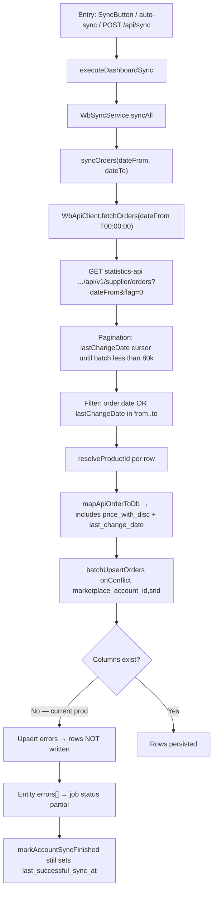

# Sprint 9.2 — Orders Synchronization Root Cause Analysis

**Type:** Investigation only (no production behavior changes)  
**Date:** 2026-07-24  
**Account examined:** `1`  
**Symptom:** Orders latest DB `order_date` = **2026-07-12**; expected **2026-07-24** (~12 day lag). Sales/Finance healthy.

---

## Executive conclusion

| Question | Answer |
|----------|--------|
| Why are Orders ~12 days behind? | Sync **fetches** recent orders from WB successfully, but **database upserts fail** because the mapper writes `price_with_disc` and `last_change_date` into `wb_orders`, and **those columns do not exist** in the live database. |
| At which step does data stop flowing? | **Database write (upsert)** — after API fetch, filter, and product resolve. |
| API / sync logic / pagination / filter / DB / scheduling? | **Database schema drift vs mapper** (migration not applied). Not API emptiness, not pagination truncation, not date-window skip of the gap rows. |
| Safest corrective action (future sprint)? | Apply migration `supabase/migrations/20260712200000_wb_orders_price_with_disc.sql`, then re-run Orders sync for the gap window. Optionally add Orders schema probe/fallback like Sales (defense in depth). |

**Confidence:** High — supported by live API counts, DB gap counts, schema probes, code asymmetry vs Sales, and git history.

---

## 1. Orders sync architecture



### Flow checklist (code)

| Step | Location | Behavior |
|------|----------|----------|
| Scheduler / entry | `sync-button.tsx`, `dashboard-operational-sync.tsx`, `POST /api/sync` | Passes UI `dateFrom`/`dateTo`; auto-sync entities include `orders` |
| Orchestration | `dashboard-sync-service.ts` → `executeDashboardSync` | Calls `syncAll` for non-finance entities |
| Sync service | `sync-service.ts` → `syncOrders` | Fetch → filter → resolve → upsert |
| API | `api-client.ts` → `fetchOrders` / `fetchPaginatedStatistics` | Statistics host, `flag=0` |
| Transform | `mappers.ts` → `mapApiOrderToDb` | Always sets `price_with_disc`, `last_change_date` |
| Upsert | `batchUpsertOrders` | Batches of 200; **no schema probe / strip** |
| Completion | `markAccountSyncFinished` | `partial` still updates `last_successful_sync_at` |

---

## 2. Wildberries endpoint

| Item | Value |
|------|--------|
| Base | `https://statistics-api.wildberries.ru` (`WB_STATISTICS_API`) |
| Path | `/api/v1/supplier/orders` |
| Method | `GET` |
| Params | `dateFrom=<cursor>`, `flag=0` |
| Initial cursor from sync | `` `${dateFrom}T00:00:00` `` (UI range start, **not** `last_successful_sync_at`) |
| Pagination | Next `dateFrom` = last row `lastChangeDate`; stop if empty or `batch.length < 80000` |
| Soft limit | 80 000 rows per page (WB statistics convention) |

**Incremental resume:** There is **no stored Orders cursor**. Each run re-fetches from the UI `dateFrom`. Dates are not “skipped” by a resume cursor; incompleteness comes from failed persistence (or not running sync), not from advancing past the gap.

---

## 3. Timeline of one synchronization execution (reconstructed)

### A. Live diagnostic run (2026-07-24, read-only — no sync write)

| T+ | Step | Evidence |
|----|------|----------|
| 0 | `fetchOrders("2026-07-13T00:00:00")` | HTTP 200 |
| ~0.4s | Page 1 | `batchSize: 335`, stop (`< 80000`) |
| — | Sync-equivalent filter | Would keep **335 / 335** |
| — | Rows with `order.date` in Jul 13–24 | **237** |
| — | Sample 25 API `srid`s vs DB | **0 present / 25 missing** |

Source: `exports/browser-proof/sprint-9-2-orders-rca/orders-api-vs-db.json`

### B. Last account sync clock

| Field | Value |
|-------|--------|
| `last_sync_at` / `last_successful_sync_at` | 2026-07-23T09:01:55Z |
| `last_sync_status` | `partial` |
| Latest persisted order | `order_date` 2026-07-12, `created_at` 2026-07-12T16:41:20Z |

So a sync job completed **after** the gap started, status **partial**, but **no** new `order_date ≥ 2026-07-13` rows exist.

### C. Typical full-sync sequence (from code + historical logs)

1. `markAccountSyncStarted` → `running`  
2. `syncProducts`  
3. `syncOrders` — fetch OK → filter OK → upsert **fails when mapper columns missing**  
4. `syncSales` — continues (has column probe / strip) → Sales stay fresh  
5. `runFinanceSyncV2` — Finance stays within lookback  
6. `resolveSyncStatus` → `partial`  
7. `markAccountSyncFinished(partial)` → **still** sets `last_successful_sync_at`

---

## 4. Investigation checklist results

### 4.1 Pagination

- Early terminate when batch &lt; 80k: **normal** for this volume (335 rows in one page).  
- **Not truncated** for the gap window — API returned continuous histogram Jul 13–24.

### 4.2 Filtering

- Orders keep row if `order.date` **or** `lastChangeDate` in range.  
- For gap window, filter would keep all 335 fetched rows.  
- **Filter is not discarding the gap.**

### 4.3 Database writes

- Upsert: `onConflict: marketplace_account_id,srid`.  
- Failed batches push `wb_orders batch N: …` into `errors[]` and **do not** increment updated count.  
- `resolveProductId` can skip individual rows on throw; sample gap is **systematic** (0/25), consistent with **batch upsert failure**, not sparse product misses.

### 4.4 API vs Database (2026-07-13 → 2026-07-24)

| Metric | API | DB |
|--------|-----|-----|
| Rows with order date in window | **237** | **0** |
| Sales with sale date in window | (healthy) | **55** |
| Sample API srids in DB | — | **0 / 25** |

**API returns orders for the missing period. They are lost at persistence.**

Order-date histogram (API) includes every day Jul 13–24 (e.g. Jul 21: 30, Jul 24: 10).

### 4.5 Schema evidence (root cause)

| Column | `wb_orders` | `wb_sales` |
|--------|-------------|------------|
| `price_with_disc` | **MISSING** | EXISTS |
| `last_change_date` | **MISSING** | N/A |
| `for_pay` | N/A | EXISTS |

Migration file present but **not applied** to live DB:

`supabase/migrations/20260712200000_wb_orders_price_with_disc.sql`  
(adds `price_with_disc` + `last_change_date` to `wb_orders`)

Mapper always emits both fields since commit `752d834` (**2026-07-17**):

```86:88:src/lib/wildberries/mappers.ts
    price_with_disc: order.priceWithDisc ?? 0,
    last_change_date: toDateString(order.lastChangeDate),
```

**Sales** have defensive probing and strip missing columns (`salesSchemaHasRevenueColumns` / `toSalesUpsertRow`).  
**Orders** have **no** equivalent — every upsert payload includes non-existent columns → PostgREST/Postgres reject → **silent from UI perspective** (only `partial` + errors array).

This explains why Sales/Finance look healthy while Orders freeze.

### 4.6 Scheduling

- Auto-sync includes `orders`.  
- Not the primary cause: even with sync running (Jul 23 clock), Orders did not advance past Jul 12.  
- Secondary factor: `partial` success timestamp masks the failure.

### 4.7 Logs

- Historical successful Orders upserts exist for older windows (e.g. `updated:920`, `errors:0`) — consistent with **pre–mapper-column** era.  
- Last rows `created_at` cluster on **2026-07-12** — day of migration authoring; **before** Jul 17 mapper commit.  
- Live Jul 23 account status `partial` aligns with entity-level errors without blocking Sales/Finance.

---

## 5. Root cause statement

**Primary root cause:**  
Schema/code mismatch — `mapApiOrderToDb` writes `wb_orders.price_with_disc` and `wb_orders.last_change_date`, but the live database never received migration `20260712200000_wb_orders_price_with_disc.sql`. Orders upserts fail; Sales continue via schema fallback / applied sales columns.

**Contributing factors:**

1. No Orders-side schema probe (unlike Sales).  
2. `partial` sync still updates `last_successful_sync_at` → operators see “synced recently” while Orders data is stale.  
3. Possible gap Jul 13–16 before mapper commit if syncs were infrequent or UI `to` lagged — but **current** inability to catch up is fully explained by the schema mismatch.

**Ruled out as primary cause:**

| Hypothesis | Verdict |
|------------|---------|
| WB API returns no orders after Jul 12 | **False** — 237 order-date rows in gap |
| Pagination truncates large sets | **False** — single page 335 &lt; 80k |
| Client date filter drops gap | **False** — 335/335 kept |
| Resume cursor skips dates | **False** — no stored Orders cursor |
| Upsert dedupe deletes new rows | **False** — srids never present |

---

## 6. Possible fixes (DO NOT IMPLEMENT in this sprint)

| # | Fix | Risk | Complexity | Expected impact | Notes |
|---|-----|------|------------|-----------------|-------|
| **1** | Apply `20260712200000_wb_orders_price_with_disc.sql` to production, then run Orders sync for gap window | **Low–Med** (DDL + backfill sync) | **Low** | **High** — restores upserts; fills Jul 13–24 | Safest first move; follow migration protocol |
| **2** | Add Orders schema probe/strip (mirror Sales) before upsert | **Low** | **Low–Med** | **Med** — prevents total write failure if columns missing again | Defense in depth; still prefer applying migration |
| **3** | Fail job hard / do not set `last_successful_sync_at` when Orders upsert errors | **Med** | **Low** | **Med** — honesty of status | Does not restore data alone |
| **4** | Surface Orders entity errors in Sync UI / verification | **Low** | **Low** | **Med** — faster detection | Reporting only |
| **5** | Change API params / pagination algorithm | **High** | **Med–High** | **Low** for this bug | **Not indicated** by evidence |
| **6** | Re-architect incremental cursor storage | **High** | **High** | **Low** for this bug | Not root cause |

**Recommended safest corrective path (future sprint):** **Fix #1**, verify with `scripts/diagnose-orders-lag.mjs`, then optionally **#2** + **#3**.

---

## 7. Evidence index

| Artifact | Path / reference |
|----------|------------------|
| API vs DB JSON | `exports/browser-proof/sprint-9-2-orders-rca/orders-api-vs-db.json` |
| Schema probe | Live: `wb_orders.price_with_disc` / `last_change_date` missing; `wb_sales.*` present |
| Migration (unapplied) | `supabase/migrations/20260712200000_wb_orders_price_with_disc.sql` |
| Mapper change | git `752d834` (2026-07-17) adds Orders columns to payload |
| Sales fallback contrast | `sync-service.ts` `salesSchemaHasRevenueColumns` / `toSalesUpsertRow` |
| Orders upsert (no fallback) | `batchUpsertOrders` + `mapApiOrderToDb` |
| Diagnostic scripts (read-only) | `scripts/diagnose-orders-lag.mjs`, `diagnose-orders-schema.mjs` |

---

## 8. Success criteria check

| Criterion | Met? |
|-----------|------|
| Why Orders 12 days behind? | **Yes** — failed upserts due to missing columns |
| Step where data stops? | **Yes** — DB upsert |
| Category of issue? | **Yes** — schema vs sync mapper (not API/pagination) |
| Safest corrective action? | **Yes** — apply orders migration, then re-sync Orders |
| Production behavior unchanged this sprint? | **Yes** — investigation + diagnostics only |

---

*End of Sprint 9.2 RCA. No sync algorithm, scheduling, API, or schema changes were applied.*
